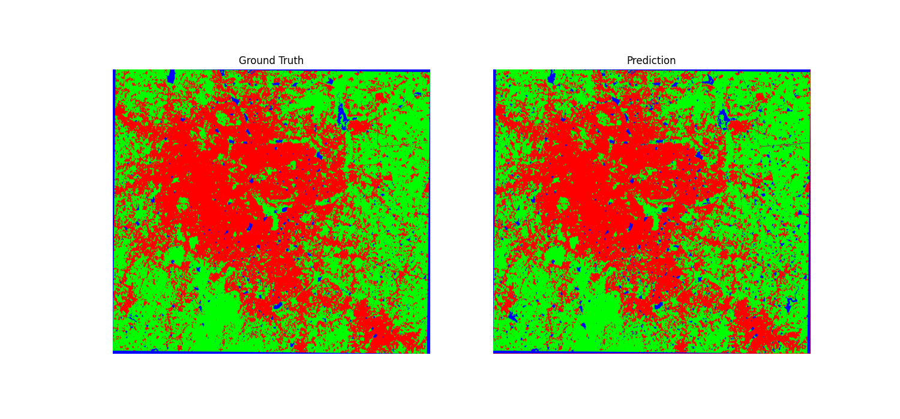
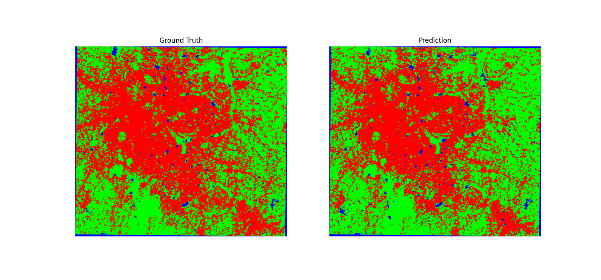

# Future Land Use Classification Using ConvLSTM-Based U-Net

## Overview
This project focuses on **predicting future land use** using deep learning techniques applied to satellite imagery. By combining **ConvLSTM** and **U-Net**, the model effectively captures both spatial and temporal dependencies for accurate classification.

## Model Architecture
- **ConvLSTM-Based U-Net:** Custom architecture designed for spatiotemporal feature extraction.
- **Framework:** PyTorch
- **Purpose:** Future land use classification from satellite images
- **Optimized for:** High accuracy predictions across diverse geographical regions

---

## Results & Visualizations

### Prediction Results
*Comparison of predicted vs actual land use patterns*

## Key Features
- **Spatiotemporal Feature Extraction** – Captures both spatial structure and temporal evolution of land use  
- **Future Land Use Classification** – Predicts land transformation trends  
- **Deep Learning-Powered** – Built with PyTorch, leveraging ConvLSTM and U-Net  
- **Robust Performance** – Generalizes well across different geographical locations  

---

## Performance Metrics
- **Overall Accuracy:** 90.3%  

